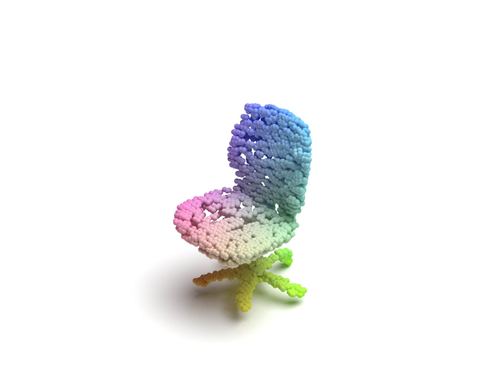

# Coarse to fine shapes

- [Coarse to fine shapes](#coarse-to-fine-shapes)
  - [About the project](#about-the-project)
  - [Setup](#setup)
    - [Prerequisites](#prerequisites)
    - [Installation](#installation)
  - [Usage](#usage)
    - [Training](#training)
  - [Results](#results)
  - [License](#license)
  - [Contributors](#contributors)
  - [Acknowledgments](#acknowledgments)

## About the project

We propose a new architecture designed to enhance the geometric detail in 3D shape generation by refining sparse and noisy point clouds.
Our approach combines the strengths of Point-Voxel Convolution (PVConv), Point Transformer, and PU-Net to refine shapes generated by Point-Voxel Diffusion (PVD) in a patch-by-patch manner.
The refinement process is designed to enrich geometric details, resulting in 3D models of higher realism and improved spatial resolution.
Empirical results highlight the architecture’s capability to improve the quality of generated 3D shapes.

This repository is based off the official [Point Voxel Diffusion implementation](https://github.com/alexzhou907/PVD)

## Setup

### Prerequisites

- Cuda drivers (tested with 11.7)
- Python 3.8

### Installation

- See `pip-requirements.txt`

## Usage

### Training

See notebooks for [airplane](./train_PVCNN_Upsample-Noise-Global-Chair-Attention-Upsampler-Patch-Based-Airplane.ipynb) and [chair](./train_PVCNN_Upsample-Noise-Global-Chair-Attention-Upsampler-Patch-Based.ipynb).
For dataset follow instructions at [PointFlow](https://github.com/stevenygd/PointFlow)

## Results

|                              Input                               |                              Output                               |
| :--------------------------------------------------------------: | :---------------------------------------------------------------: |
|  |  |
|     |     |

## License

See [License.md](LICENSE.md).

## Contributors

[Kristiyan Sakalyan](kristiyan.sakalyan@tum.de), [Stephan Schmiedmayer](stephan.schmiedmayer@tum.de)

## Acknowledgments

Thank you to our supervisor Lei Li.
